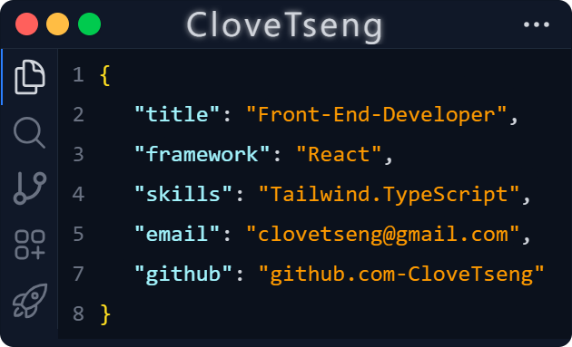

 

### Hi, 我是 Clove，熱衷於前端開發、積極打造厚實硬底子並保持靈活的思維，重視網頁效能及 coding 的品質。👋  

* 身為一位前端工程師，我主要負責前端開發領域，保持開放的心態了解並學習其他面向的知識與技術。[^1]
* 在專案中使用 Git 與組員協作，並且分享 Git / GitHub 相關知識、協助解決衝突的經驗。[^2]。
* 我的優勢包括有效的統整能力，能夠更好的設計架構並將任務拆解，並在跨部門協作中能撰寫清晰的文件。[^3]

[^1]: [Study Articles | 學習筆記](#study-articles--學習文章)
[^2]: [2024 切版班第八週主線任務 - git 協作](https://zenn.dev/chloetseng/articles/week8-main-mission)
[^3]: [2024 切版專題 - 餘味尋蹤](https://github.com/CloveTseng/flavor-trail-react)

<!-- 👉 <a href="#"> 個人作品集網站 (建置中) </a>  
  -->

## Resume | PDF 履歷下載

 

## Skills & Tools | 技能與工具
`React` `JavaScript` `TypeScript` `Tailwind` `Bootstrap` `RESTful API` `AJAX` `Git / GitHub` 
### React
- 使用 Vite + React 開發 SPA 網站經驗
- 能運用 Hook，掌握元件資料流與拆分元件
- 使用 React Router 建構路由
- 使用 React Hook Form 製作表單及驗證功能
- 使用 Redux 進行複雜狀態管理

### JavaScript
- 基礎 JavaScript 語法
- ESLint 管理程式碼風格
- 熟悉 AJAX / JSON，使用 Axios 串接
- RESTful API 能力
- 使用 JSON server 模擬 RESTful API 經驗

### 前端技術
- 熟悉 HTML5 / CSS 3
- RWD 響應式開發經驗
- 熟悉 Bootstrap 5 ，可客製樣式
- 熟悉 OOCSS 設計模式
- 熟悉 Sass
- 使用 Git / GitHub 進行版本控制與團隊協作經驗

## Project | 專案

### Flavor Trail：餘味尋蹤
2024/06 - 2025/03

`React` `React Router` `RESTful API` 

我們希望創建一個平台，讓商家和個人能夠方便地 **捐贈或領取剩食**，從而促進資源的有效利用，保護環境， 通過合作和參與實現「零食物浪費」的目標，打造更可持續的未來。

> 主要負責

- 使用 JSON Server 搭配 Render 模擬實際 RESTful API
- 使用 React Hook Form 處理網站表單輸入及資料驗證
- 使用 React Router 的巢狀路由打造『我的帳號』分頁切換功能
- 客製化 Bootstrap 切版與 RWD 設計，適應桌機與手機使用體驗
- 建立客製化變數文件，方便開發時快速的查找
- 依據 GitHub Flow 規則設計分支結構，統一命名規則與協作流程

<a href="https://github.com/CloveTseng/flavor-trail-react" target="view_window">GitHub</a> | <a href="https://ariel0508.github.io/flavor-trail-react/" target="view-window">Demo</a>

---

### iRun：AI 陪伴健身教練
2024/09 - 2024/10

`Sass/Scss` `Bootstrap` `切版`

此專案為六角學院前端學員與 AAPD 設計學員跨領域協作，純手刻切版專題。
希望打造一款由 AI 教練陪伴的健身 App Prototype，主打「陪伴感」與「入門友善」。

> 主要負責

- 使用客製化 Bootstrap 進行主頁與登入頁面畫面切版
- 填寫個人身體數據表單及運動頻率選單頁面切版
- 搭配設計團隊提供之 Design System ，建立變數表文件方便後續開發進行

<a href="https://github.com/CloveTseng/iRun" target="view_window">GitHub</a> | <a href="https://ariel0508.github.io/flavor-trail-react/" target="view-window">Demo</a>

 

## Study Articles | 學習文章

### 框架相關
* [2024 每日 React 任務](https://zenn.dev/chloetseng/articles/2024-react-dailymission)
### JS 相關
* [2024 每日 JS 任務](https://zenn.dev/chloetseng/articles/2024-js-dailymiss)
* [2024 codewars 每日刷題](https://zenn.dev/chloetseng/articles/69c83edc65283e)
### 切版相關
* [2024 每日 切版 任務](https://zenn.dev/chloetseng/articles/2024-layout-course-dailymission)
* [2024 切版班上機考](https://zenn.dev/chloetseng/articles/fe884fb860290b)
### 後端相關
* [2024 資料庫體驗營](https://zenn.dev/chloetseng/articles/2024-sql-experience-camp)
### 其他
* [json-server 學習筆記]()

## Contact Me | 💬 連絡我

---
 

<!--
**CloveTseng064/CloveTseng064** is a ✨ _special_ ✨ repository because its `README.md` (this file) appears on your GitHub profile.

Here are some ideas to get you started:

- 🔭 I’m currently working on ...
- 🌱 I’m currently learning ...
- 👯 I’m looking to collaborate on ...
- 🤔 I’m looking for help with ...
- 💬 Ask me about ...
- 📫 How to reach me: ...
- 😄 Pronouns: ...
- ⚡ Fun fact: ...
-->
