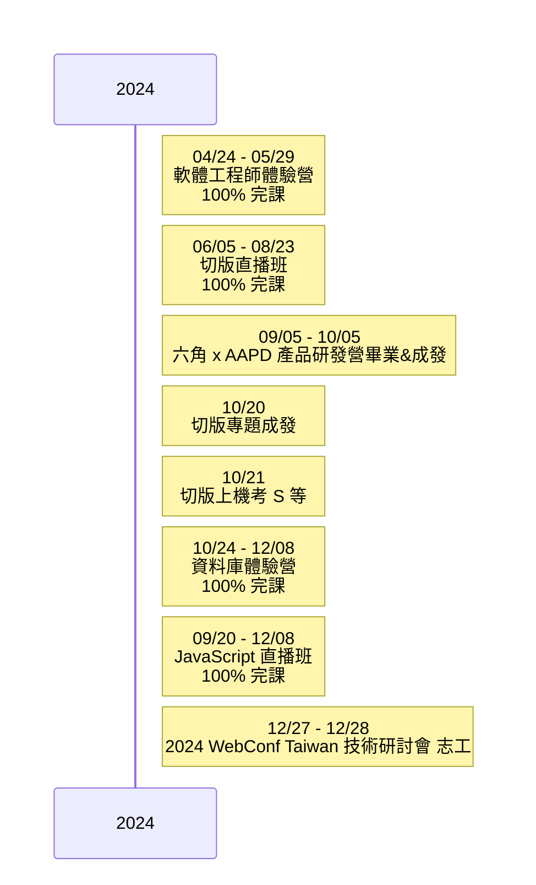

<p align="center">
 
</p>


### Hi, 我是 Clove，熱衷於前端開發、積極打造厚實硬底子並保持靈活的思維，重視網頁效能及 coding 的品質。👋 <br/>

* 身為一位 Junior Software Programmer，我主要負責前端開發領域，保持開放的心態了解並學習其他面向的知識與技術。[^1]
* 在專案中使用 Git 與組員協作，並且分享 git 相關知識、協助解決 git 衝突的經驗。[^2]。
* 我的優勢包括有效的統整能力，能夠更好的設計架構並將任務拆解，並在跨部門協作中能撰寫清晰的文件。[^3]

[^1]: [Study Articles | 學習筆記](#study-articles--學習文章)
[^2]: [2024 切版班第八週主線任務 - git 協作](https://zenn.dev/chloetseng/articles/week8-main-mission)
[^3]: [2024 切版專題 - 餘味尋蹤]()

👉 <a href="#"> 個人作品集網站 (建置中) </a> <br/>
<br>

## Resume | PDF 履歷下載


<br/>


## Skills & Tools | 技能與工具

```javascript
const cloveTseng = {
    skills: [Javascript, HTML, CSS, Git],
    tools: [React, Sass, Bootstrap, GitHub Pages, VSCode],
    iCan: ['RWD', 'fix conflict', 'semantic elements'] 
    language: {
        traditionalChinese: '母語',
        english: '能閱讀技術文件',
        chinese: '能閱讀技術文件'
    }
}

```

## Project | 專案

* <a href="https://ariel0508.github.io/FlavorTrail/index.html">🌱 Flavor Trail </a>：餘味尋蹤

<br>


## Study Articles | 學習文章

### 框架相關
* [2024 每日 React 任務](https://zenn.dev/chloetseng/articles/2024-react-dailymission)
### JS 相關
* [2024 每日 JS 任務](https://zenn.dev/chloetseng/articles/2024-js-dailymiss)
* [2024 codewars 每日刷題](https://zenn.dev/chloetseng/articles/69c83edc65283e)
### 切版相關
* [2024 每日 切版 任務](https://zenn.dev/chloetseng/articles/2024-layout-course-dailymission)
* [2024 切版班上機考](https://zenn.dev/chloetseng/articles/fe884fb860290b)
### 後端相關
* [2024 資料庫體驗營](https://zenn.dev/chloetseng/articles/2024-sql-experience-camp)
### 其他
* [json-server 學習筆記]()

## Contact Me | 💬 連絡我

<a href="discordapp.com/users/1218426159423819809"></a>
<a href="mailto:dolcetseng@gmail.com"></a>

---
 

<!--
**CloveTseng064/CloveTseng064** is a ✨ _special_ ✨ repository because its `README.md` (this file) appears on your GitHub profile.

Here are some ideas to get you started:

- 🔭 I’m currently working on ...
- 🌱 I’m currently learning ...
- 👯 I’m looking to collaborate on ...
- 🤔 I’m looking for help with ...
- 💬 Ask me about ...
- 📫 How to reach me: ...
- 😄 Pronouns: ...
- ⚡ Fun fact: ...
-->
